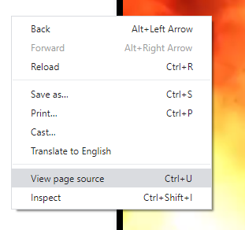
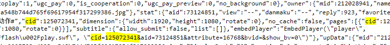

# bilibili_commentary_subtitles
根据发弹幕的频率来查找恶意刷弹幕的人或者特别关心你的人

find user by frequency of commentary subtitles (bilibili.com)

## Use ##
```shell
[frequency]: min number of the commentary subtitle, I suggest greater than 10
             as low frequency users are not of interest, and it takes time to calulate the hash

python find_user.py [xml_file_name] [frequency]
```
Example
```shell
python find_user.py 110417133.xml 10
```
Result

(user_address, count_of_commentary subtitle)
```poweshell
('https://space.bilibili.com/1938271', 17)
('https://space.bilibili.com/419280845', 16)
```

## How to get xml file ##

Example

Video: https://www.bilibili.com/video/av73124851?spm_id_from=333.851.b_62696c695f7265706f72745f646f756761.18

1. view page source



2. search for "cid"



3. address = f"http://comment.bilibili.com/{cid}.xml" 

    cid = 110417133

    http://comment.bilibili.com/110417133.xml

    save it and it's done! ^_^
 
 
 ## Thanks to ##
 https://github.com/Aruelius/crc32-crack
