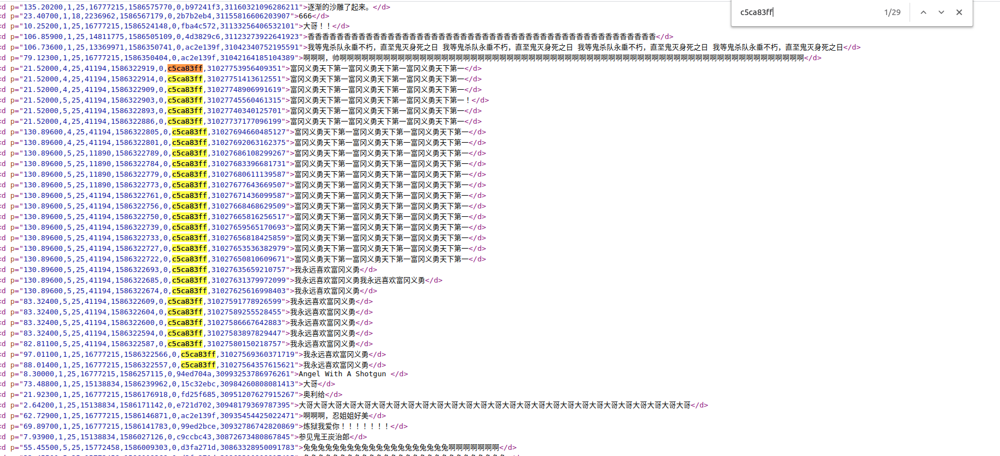
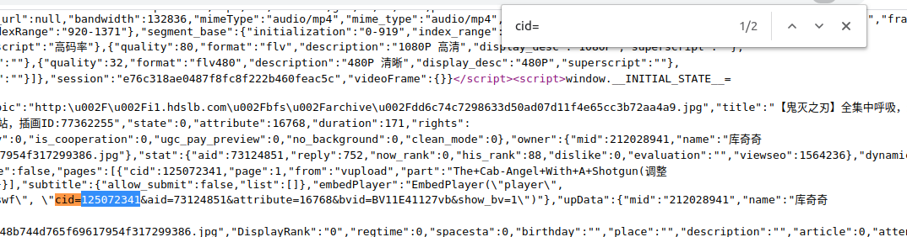

# bilibili_commentary_subtitles
根据发弹幕的频率来查找恶意刷弹幕的人

find user by frequency of commentary subtitles (bilibili.com)

## Use ##
```shell
[frequency]: min number of the commentary subtitle, I suggest greater than 10 as low frequency users are not of interest, and it takes time to calculate the hash_code

[cid]: the cid of the video that you want to examine
```
Download the xml file
```shell
python dl_xml.py [cid]
```
Find the target user
```shell
python find_user.py [xml_file_name] [frequency]
```
Example: run this two command in ./find_user/
```shell
python dl_xml.py 125072341

python find_user.py 125072341.xml 10
```
Result

(user_address, hashed_uid, count_of_commentary_subtitle)
```shell
('https://space.bilibili.com/12575546', 'c5ca83ff', 29)
('https://space.bilibili.com/438948456', '9b8b8d5', 29)
('https://space.bilibili.com/361166585', 'eb887d55', 28)
('https://space.bilibili.com/49839038', '22d7aaec', 17)
('https://space.bilibili.com/499936350', '80dcb73a', 11)
```
Open xml in the browser and search for hashed_uid



## How to get cid ##

Example

Video: https://www.bilibili.com/video/av73124851?spm_id_from=333.851.b_62696c695f7265706f72745f646f756761.18

1. view page source


2. search for "cid="



## Requirement ##
if I'm right, there is only one package to install :)

```shell
pip install -r requirements.txt
```
 
 ## Thanks to ##
 https://github.com/Aruelius/crc32-crack
